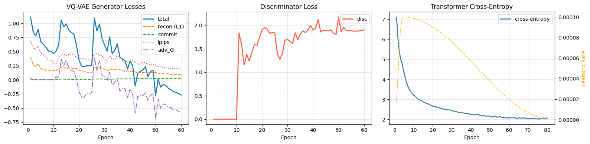
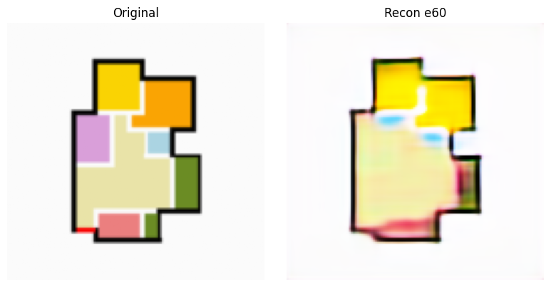
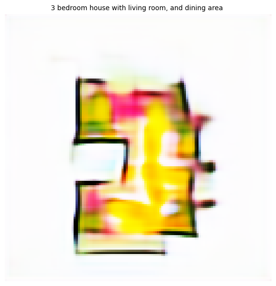

# 🏠 Floor Plan Generation — Deep VQ-VAE v3 + Causal Transformer

> Text-conditioned floor plan synthesis using a Vector-Quantized Variational Autoencoder with adversarial training and a GPT-2-scale Causal Transformer conditioned on a LoRA-fine-tuned Llama-3.2-1B.

---

## 📌 Table of Contents

- [Overview](#overview)
- [Architecture](#architecture)
- [Dataset](#dataset)
- [Training Details](#training-details)
- [Loss Curves & Analysis](#loss-curves--analysis)
- [Reconstruction Quality](#reconstruction-quality)
- [Inference & Sample Output](#inference--sample-output)
- [Limitations & Future Work](#limitations--future-work)
- [Repository Structure](#repository-structure)
- [Requirements](#requirements)
- [How to Run](#how-to-run)

---

## Overview

This project builds a two-stage generative model for floor plan images conditioned on natural language text descriptions (e.g., *"3 bedroom house with living room and dining area"*).

**Stage 1 — Deep VQ-VAE:** Learns a discrete latent codebook representation of floor plan images. The encoder compresses 128×128 images into 16×16 = 256 discrete tokens drawn from a codebook of size 2048.

**Stage 2 — Causal Transformer:** An auto-regressive GPT-style model (12 layers, d_model=768) that predicts the next VQ token conditioned on text features extracted from a LoRA-fine-tuned Llama-3.2-1B language model. At inference time, Classifier-Free Guidance (CFG) is applied to boost text fidelity.

---

## Architecture

### Stage 1: VQ-VAE

| Component | Detail |
|---|---|
| Encoder | 3 downsampling stages, 6 ResBlocks each, GroupNorm + SiLU |
| Bottleneck | Self-attention layer for spatial reasoning |
| Codebook | 2048 codes × 512-dim, EMA-updated with dead-code restart |
| Decoder | Symmetric to encoder, 3 upsampling stages |
| Loss | L1 Reconstruction + LPIPS Perceptual + Commitment + PatchGAN Adversarial |
| Parameters | ~158M |

**Key improvements over v2:**
- Codebook dimension raised from 256 → 512 (resolved the 0.4% utilisation collapse)
- EMA codebook updates with random restart for dead codes
- PatchGAN discriminator for crisp room boundaries

### Stage 2: Causal Transformer

| Component | Detail |
|---|---|
| Layers | 12 TransformerDecoder layers |
| d_model | 768 (GPT-2 Medium scale) |
| Attention heads | 12 |
| Text conditioning | Cross-attention to Llama-3.2-1B hidden states (2048→768 projection) |
| Positional encoding | Sinusoidal |
| Sequence length | 256 tokens (16×16 spatial grid) |
| Parameters | ~121M |
| LLM backbone | Llama-3.2-1B, 4-bit NF4 quantized, LoRA fine-tuned |

**LoRA config:** rank=16, alpha=32, applied to all attention + MLP projection layers.

---

## Dataset

| Property | Value |
|---|---|
| Dataset | DALEE (floor plan image-text pairs) |
| Image resolution | 128 × 128 px |
| VQ tokens per image | 256 (16×16 grid) |

> ⚠️ **Note:** The model was trained on a very small dataset .This is a significant constraint and is the primary reason for the observed generation quality limitations. See [Limitations](#limitations--future-work) for details.

---

## Training Details

### VQ-VAE Training

| Hyperparameter | Value |
|---|---|
| Epochs | 60 |
| Optimizer | AdamW (β₁=0.5, β₂=0.9) |
| Learning Rate | 2e-4 |
| Scheduler | CosineAnnealingWarmRestarts (T₀=20, T_mult=2) |
| Warmup | 5 epochs linear warmup |
| Batch size | ~4 (25 batches/epoch over 102 samples) |
| Adversarial loss weight | Enabled from epoch ~12 onwards |
| Mixed precision | AMP (float16) |
| Commit beta | 0.25 |
| EMA decay | 0.99 |

### Transformer Training

| Hyperparameter | Value |
|---|---|
| Epochs | 80 |
| Optimizer | AdamW (β₁=0.9, β₂=0.95) |
| Max Learning Rate | 1e-4 |
| Scheduler | OneCycleLR (5% warmup, cosine decay) |
| Gradient accumulation | Enabled |
| Gradient checkpointing | Enabled (LLM) |
| CFG dropout | Text dropped ~10% of training for unconditional path |

---

## Loss Curves & Analysis

### Training Curves



#### VQ-VAE Generator Losses (left panel)
The total VQ-VAE generator loss starts high (~1.1) due to the combination of L1 reconstruction, LPIPS perceptual loss, commitment loss, and adversarial generator loss. Key observations:

- **Reconstruction (L1):** Steadily decreases from ~0.35 at epoch 1 to **~0.094 at epoch 60**, demonstrating the model learned meaningful spatial structure.
- **LPIPS (perceptual):** Drops from ~0.6 to ~0.19 over 60 epochs, indicating progressively sharper and more perceptually plausible reconstructions.
- **Commitment loss:** Stays very low and stable throughout (~0.005–0.023), indicating healthy codebook learning without excessive codebook drift.
- **Adversarial Generator loss (adv_G):** Begins engaging around epoch 12 and trends negative, which is the expected and healthy behaviour — the generator is successfully fooling the discriminator in a hinge-loss GAN setup.
- **Total loss:** Shows noisy oscillation, largely driven by the adversarial term; this is typical in GAN training and does not indicate divergence.

#### Discriminator Loss (middle panel)
The PatchGAN discriminator loss starts near 0 for the first ~10 epochs (before the adversarial loss is activated), then rapidly rises and stabilizes around **1.8–2.1**, which is the expected saturation range for a hinge-loss discriminator when both generator and discriminator are competitively balanced.

#### Transformer Cross-Entropy (right panel)
The cross-entropy loss on next-token prediction drops sharply from **~7.1 → ~2.1**, which is a strong improvement (bit-rate reduction from ~10 bits to ~3 bits per token). However, the loss plateaus around epoch 55–60 and stops improving meaningfully through epoch 80 (final CE: **2.07**). This plateau is characteristic of over-training a large-capacity model on a small dataset.

### Codebook Utilisation

| Epoch | Utilisation |
|---|---|
| 5 | 40.3% |
| 10 | 48.2% |
| 15–60 | ~50–51% |

Codebook utilisation stabilizes at ~50% — a significant improvement over the 0.4% collapse seen in v2. This confirms that the EMA updates and dead-code random restart mechanism are working correctly. However, ~50% utilisation on a 2048-code book means roughly 1024 codes are actively used, which is still reasonable for this dataset size.

---

## Reconstruction Quality

### VQ-VAE Reconstruction at Epoch 60



The VQ-VAE reconstruction at epoch 60 shows that the model has learned the **overall structural layout** of the floor plan — the bounding shape, the general positioning of rooms, and the wall boundaries are recognizable. However, the fine-grained **room colour segmentation** (which encodes room type in this dataset) is blurred and mixes between adjacent rooms, especially at the boundaries. This is primarily a consequence of training on only 102 images — the model has insufficient variety to learn sharp colour-class boundaries.

---

## Inference & Sample Output

### Generated Sample

**Prompt:** `"3 bedroom house with living room, and dining area"`



The generated floor plan shows that the model has learned:
- **Structural shape:** An outer bounding polygon with wall-like boundaries (black outlines) is clearly visible.
- **Multi-room layout:** Multiple distinct coloured regions are present, corresponding to different room types.
- **Rough proportions:** The generated plan has a plausible aspect ratio and spatial extent.

However, the output is noticeably **blurry and colour-mixed**, with room boundaries poorly defined compared to a real floor plan. This is a direct consequence of the small training set and the ~50% codebook utilisation — the discrete latent space doesn't have enough coverage to render sharp details from novel prompts.

**Inference settings used:**
- CFG guidance scale: 4.5
- Temperature: 1.0
- Top-k: 256
- Top-p: 0.95

---

## Limitations & Future Work

### Current Limitations

1. **Tiny dataset (102 pairs):** This is the dominant bottleneck. A generative model with 158M + 121M parameters is severely over-parameterized for 102 training examples. The model memorizes rather than generalizes, leading to blurry, averaged-out outputs on unseen prompts.

2. **~50% codebook utilization:** While a massive improvement over v2's 0.4%, half the codebook remains unused. This limits the expressiveness of the discrete representation. A larger, more diverse dataset would push utilisation higher.

3. **Blurry reconstructions:** The VQ-VAE correctly captures layout structure but fails to produce crisp room-colour boundaries. This is a perceptual quality issue arising from the small dataset and the 128×128 resolution.

4. **Transformer plateau:** Cross-entropy stops improving around epoch 55, indicating the transformer has exhausted the information available in the 102 training prompts and is beginning to overfit.

5. **128×128 resolution:** Floor plans have fine-grained structural details (walls, doors, dimensions) that are difficult to represent at this resolution.

### Suggested Improvements

- **Scale the dataset:** 1000+ paired samples would dramatically improve both reconstruction sharpness and generation coherence. Consider augmentation (flips, rotations, colour jitter) to multiply effective training data.
- **Increase resolution to 256×256:** This would require adjusting the encoder depth and increasing the sequence length, but would allow more architectural detail.
- **Push codebook utilisation above 80%:** Explore factorized / product quantization or hierarchical VQ-VAE for better codebook coverage.
- **Experiment with diffusion-based decoding:** Replace the auto-regressive transformer with a masked or diffusion-based token predictor for potentially sharper and more diverse outputs.
- **Fine-tune the full LLM:** Currently the LLM backbone is 4-bit quantized with LoRA; given more GPU memory, full fine-tuning on domain-specific room descriptions would improve text alignment.
- **Add FID evaluation loop:** The FID computation infrastructure is already in the notebook; running it on a larger held-out set would give a quantitative quality metric.

---


---

## Requirements

```
torch>=2.0
torchvision
transformers
peft
bitsandbytes
lpips
torchmetrics
einops
scipy
wandb
accelerate
Pillow
matplotlib
```

Install all at once:
```bash
pip install transformers accelerate peft bitsandbytes lpips torchmetrics scipy wandb einops
```

The notebook is designed to run on **Google Colab with a T4/A100 GPU**. Training the VQ-VAE (60 epochs) takes approximately 2–3 hours on a T4. The Transformer (80 epochs) takes approximately 3–4 hours.

---

## How to Run

1. **Mount Google Drive** and place the DALEE dataset at:
   ```
   /content/drive/MyDrive/DALEEtrain/DALEEtrain/images/
   /content/drive/MyDrive/DALEEtrain/DALEEtrain/labels/
   ```

2. **Open the notebook** in Google Colab and run cells in order (1 → 15).

3. **To skip retraining**, load the saved checkpoint (cell 10 loads `vqvae_best.pt` automatically) and go directly to cell 11 for inference.

4. **To generate a floor plan:**
   ```python
   img = generate("2 bedroom apartment with open kitchen", guidance=4.5)
   ```

---

## Notes on Low-Data Training

This model was intentionally trained on a small dataset as a **proof of concept** and architecture validation exercise. The primary goal was to:

- Verify that the VQ-VAE codebook collapse issue from v2 is resolved ✅
- Confirm that the PatchGAN discriminator activates and stabilizes correctly ✅
- Validate that the Causal Transformer can learn a meaningful token distribution ✅
- End-to-end test the text-conditioning pipeline with Llama-3.2 + LoRA ✅

All of these goals were achieved. The generation quality will scale with dataset size — the architecture is sound, the training pipeline is validated, and the next step is simply data collection.

---

*Built with PyTorch · Hugging Face Transformers · PEFT / LoRA · LPIPS · Google Colab*
